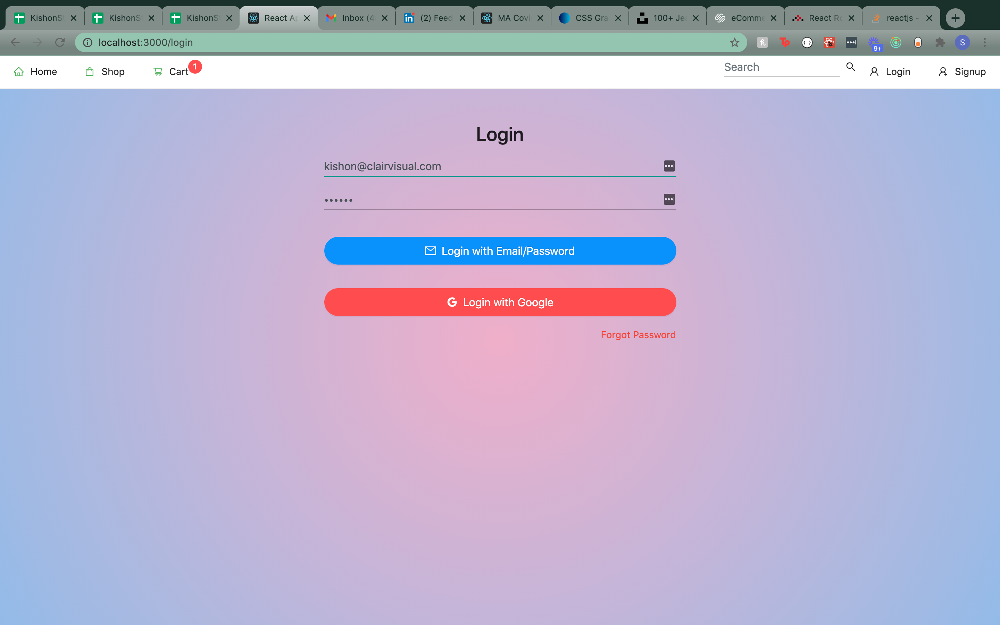
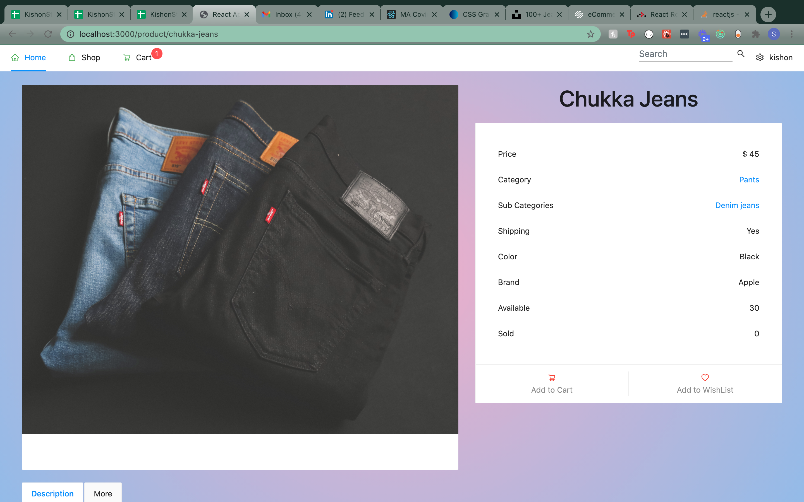

# ecommence_project4

### Demo - http://p4-claires.surge.sh/

### Frontend repo- https://github.com/dazamg/Claires.git

## Wireframes

## User Stories
- As a user, I would like be able to see available products
- As a user, I would like to search for a product 
- As a user, I would like to add products to my cart
- As a user, i would like to view a product 
- As a user, i would like to save a item for later

## Technology used
- React
- axios
- Ant design
- React Router
- FireBase
- Redux
- mongoDB

## Installation Instructions
- download and install backend repo
- create an admin user in the backend
- download frontend repo and run npm i to install all dependencies
- with backend running, npm start the app
- create an account (or login as your admin), and start browsing Products

## General Approach
I wanted to get a deeper understanding of react. Since eccommence is on the raise, i thought this will be my perfect final project. Showcasing what i've learned in and out of class. By showcasing my skills for basic functionality 

## Stretch Goals
- Checkout and payment page
- Create filter/categories on the products page
- Inprove the overall design of the website

## Major Hurdles
- Setting up the backend product model. It was a big challenge in knowing which model or product is a role or object/ref of the other

## Acknowledgements
I used the following course to help troubleshoot some of my conditioning issues:
- https://www.udemy.com/share/101WbyAEEeclZSTHkD/

-StackOverflow
-Youtube

React packages that help me alot:
- https://www.npmjs.com/package/react-image-file-resizer
-https://www.npmjs.com/package/typewriter-effect
-https://www.npmjs.com/package/react-responsive-carousel

My GIRLFRIEND and ALA for helping me Q&A with the backend
And of course, thank you to our General Assembly instructors and IAs for the help and support. Billie for always being there